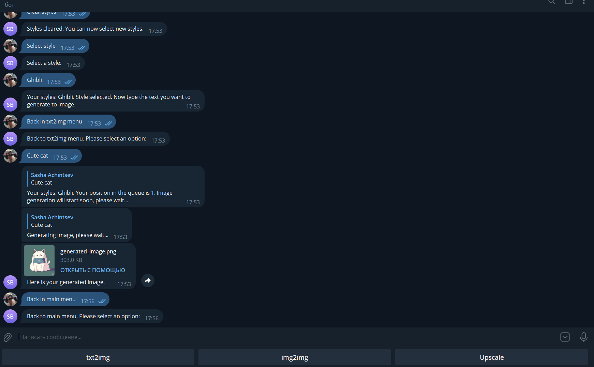

# Stable Diffusion Telegram Bot
## Description
Stable Diffusion Telegram Bot - это телеграм-бот, который предоставляет возможности по работе с изображениями. Он позволяет преобразовать текст в изображение, применять перенос стиля для изображений и увеличивать разрешение изображений.

## Features 
  - Преобразование текста в изображение (txt2img): Пользователи могут ввести текст и преобразовать его в изображение, выбрать стиль для  текста.

  - Стилевая переноска для изображений (img2img):  В этом режиме можно загрузить изображение и применить к нему различные стили.

    - В этом режиме пользователи могут:
      - Выбрать стиль
      - Выбрать метод переноса стиля (OpenPose, Depth, Canny)
      - Загрузить фото, для которого делается перенос
      - Повторить перенос стиля с теми же настройками
      - Очистить выбранные стили

  - Увеличение разрешения изображения (Upscale): В этом режиме пользователи могут выбрать множитель увеличения и отправить фото, которое будет обработано и возвращено с увеличенным разрешением.

## Installation and Running
## 1. Stable Diffusion Web UI
- Настройте и установите Stable Diffusion web UI на свой сервер по инструкции из этого репозитория - [stable-diffusion-webui](https://github.com/AUTOMATIC1111/stable-diffusion-webui)
- Настройки (после каждого пункта сохраняйте настройки и перезапускайте UI):
  - В Web UI установите расширение sd-webui-controlnet.
  - В настройках, в пункте Upscale выберите модель R-ESRGAN General WDN 4xV3.

- После этого выключите Web UI и запустите его с аргументами --listen --api-log --api --enable-insecure-extension-access.

## 2. Clone the Repository and Launch
- Склонируйте репозиторий бота в нужную папку на сервере со Stable Diffusion:
  - git clone https://github.com/SashaAch/StableDiffusionBot

- В папке создайте файл .env с переменной TELEGRAM_BOT_TOKEN и TELEGRAM_BOT_HOST, с токеном бота и адресом Stable Diffusion web UI:

    - TELEGRAM_BOT_TOKEN=tg_bot_token
    - TELEGRAM_BOT_HOST=127.0.0.1

- На сервере соберите образ docker:
    - sudo docker build -t upscale_tg_bot .
- Запустите образ Docker:
    - sudo docker run -p 4000:80 upscale_tg_bot
